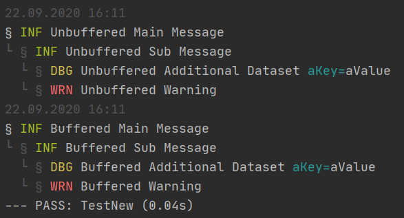

# bufferedlogger

Creates a buffered or unbuffered logger with some set view options.

First of all, the log has 3 levels and shown as tree.
The date and time are shown only if `log.title` is called.

